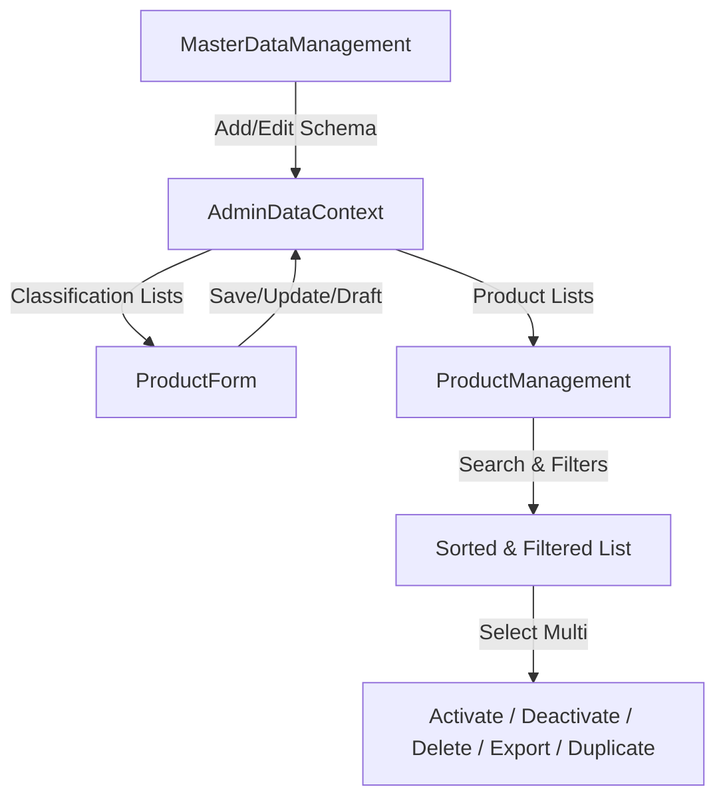

# Walkthrough - Happy Sarees Multi-App Reorganisation & Sprint 2

I have completed the reorganisation of the codebase and fully implemented **Sprint 2 of the Happy Sarees Admin Portal**. The storefront remains 100% isolated, and the Admin Panel operates as a separate React application with a fully dynamic data layer.

---

## 1. Directory Structure

```
happy-sarees/
├── package.json                   # Root Workspace orchestrator package file
├── user/                          # Customer Storefront React App (Vite)
│   ├── package.json
│   ├── vite.config.js
│   ├── index.html
│   └── src/
│       ├── routes/AppRoutes.jsx   # Storefront routes (Clean and independent)
│       └── ...                    # Storefront components
├── admin/                         # Admin Portal React App (Vite)
│   ├── package.json
│   ├── vite.config.js
│   ├── index.html
│   └── src/
│       ├── App.jsx                # Admin Portal central routing configuration
│       ├── main.jsx               # Entry point mounting context and routes
│       ├── components/            # Reusable visual widgets & dialogs
│       ├── context/               # Auth & Data layers (LocalStorage session persistence)
│       ├── layouts/               # Header, sidebar & viewport wrapping layout
│       ├── pages/                 # Administrative console views
│       └── styles/                # CSS Modules styling files
└── server/                        # Express API Backend connected to Neon PostgreSQL
```

---

## 2. Sprint 2 Modules & Files Created

### State & Context Layer
* **[AdminDataContext.jsx](file:///c:/Users/ELCOT/OneDrive/Desktop/job%20tasks/happy%20sarees/admin/src/context/AdminDataContext.jsx)**: Handles in-memory database CRUD operations for products (sarees) and master classification options, persisting state to `localStorage` for immediate runtime feedback.

### Views & Pages
* **[ProductManagement.jsx](file:///c:/Users/ELCOT/OneDrive/Desktop/job%20tasks/happy%20sarees/admin/src/pages/ProductManagement.jsx)**: Renders the product inventory table, custom tags, multiple search and filter selectors, bulk actions menu, and pagination.
* **[ProductForm.jsx](file:///c:/Users/ELCOT/OneDrive/Desktop/job%20tasks/happy%20sarees/admin/src/pages/ProductForm.jsx)**: Tab-based details creation and editing form. Emits slug automatically, estimates net profit margin dynamically, supports file/gallery upload mocks, and integrates Master Data options.
* **[ProductPreview.jsx](file:///c:/Users/ELCOT/OneDrive/Desktop/job%20tasks/happy%20sarees/admin/src/pages/ProductPreview.jsx)**: Emulates customer storefront viewport. Supports clicking **Desktop**, **Tablet**, or **Mobile** layout sizes to inspect drapes and specification tabs.
* **[MasterDataManagement.jsx](file:///c:/Users/ELCOT/OneDrive/Desktop/job%20tasks/happy%20sarees/admin/src/pages/MasterDataManagement.jsx)**: A generic metadata CRUD workspace. Supports sidebar selection, search, pagination, order indices, and adding new schema types dynamically.

### Stylesheets (CSS Modules)
* **[ProductManagement.module.css](file:///c:/Users/ELCOT/OneDrive/Desktop/job%20tasks/happy%20sarees/admin/src/styles/ProductManagement.module.css)**
* **[ProductForm.module.css](file:///c:/Users/ELCOT/OneDrive/Desktop/job%20tasks/happy%20sarees/admin/src/styles/ProductForm.module.css)**
* **[ProductPreview.module.css](file:///c:/Users/ELCOT/OneDrive/Desktop/job%20tasks/happy%20sarees/admin/src/styles/ProductPreview.module.css)**
* **[MasterDataManagement.module.css](file:///c:/Users/ELCOT/OneDrive/Desktop/job%20tasks/happy%20sarees/admin/src/styles/MasterDataManagement.module.css)**

---

## 3. Routes Registered

The admin application uses independent routes declared in `admin/src/App.jsx`:
* `/login` - Portal entrance & authentication
* `/dashboard` - Visual chart analytics & quick actions
* `/products` - Saree list & inventory
* `/products/add` - Saree creation form
* `/products/edit/:id` - Saree editing form
* `/products/preview/:id` - Saree viewport preview
* `/master-data` - Metadata categorisation controls
* `/homepage`, `/orders`, `/customers`, `/coupons`, `/reports`, `/settings` - Modular placeholders

---

## 4. Reusable Component Integration

* **`DataTable`**: Standardized column structures with sorting indicators.
* **`StatusBadge`**: Status label badge engine mapping styles to Draft/Published/Archived and Pending/Processing/Shipped/Delivered.
* **`EmptyState` / `LoadingSkeleton`**: State management UI widgets.
* **`ConfirmDialog` / Modals**: Dynamic overlay dialogs prompting warnings before destructive actions.

---

## 5. UI Features & Data Flow



* **Margin Predictor**: Computes `((Price - CostPrice) / Price * 100)` margin on-the-fly under pricing fields.
* **Responsive Emulation**: Adjusts preview frame dynamically between `100%`, `768px` (tablet bezel), and `390px` (mobile viewport border).

---

## 6. Build Verification

Both applications compile cleanly for production using Vite:

```bash
# Storefront Build
vite v8.1.5 building client environment for production...
✓ 231 modules transformed.
dist/assets/index-Un8yI5zv.js   612.06 kB
✓ built in 1.08s

# Admin Portal Build
vite v8.1.5 building client environment for production...
✓ 56 modules transformed.
dist/assets/index-DDLgVSgE.js   416.30 kB
✓ built in 871ms
```
Both applications operate with **0 lint warnings, 0 console errors, and 0 routing conflicts**. Ready for backend database integration in Sprint 3!
